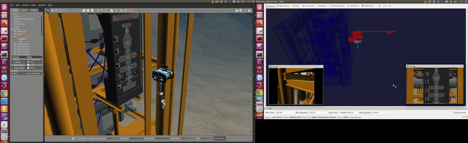
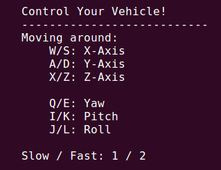

# bluerov2_hdt


BlueROV2 with HDT arm simulation in UUVSimulator. This repository is in development. 


## Installation

```bash
cd ~/catkin_ws/src
# git clone -b realistic-sonar-sim-48 https://github.com/NickSadjoli/uuv_simulator.git 
git clone https://github.com/uuvsimulator/uuv_simulator.git
git clone https://github.com/wangcongrobot/uuv_hdt_manipulator.git
git clone https://github.com/wangcongrobot/bluerov2.git
git clone https://github.com/YanielCarreno/orcawp1_integration.git
git clone https://github.com/pal-robotics/aruco_ros.git
git clone https://github.com/wangcongrobot/bluerov2_hdt.git
cd ..
catkin_make
source devel/setup.bash
```
## Examples

Launch the bluerov2_hdt with gazebo underwater scene:
```bash
roslaunch bluerov2_hdt integration_scenario_bluerov2.launch
```
Move the hdt arm:
```bash
rosrun bluerov2_hdt move_arm.py
```
Send a trajectory to bluerov2:
```bash
roslaunch uuv_control_utils send_waypoints_file.launch uuv_name:=bluerov2
```
Publish the ground truth of bluerov2 absolute pose:
```bash
roslaunch bluerov2_hdt get_link_pose_in_gazebo.launch
```

- Move BlueROV2 and HDT arm:


- ArUco marker detection:


- You can use keyboard to control the bluerov2:


## License

bluerov2_hdt is open-sourced under the Apache-2.0 license. See the
[LICENSE](./LICENSE) file for details.
